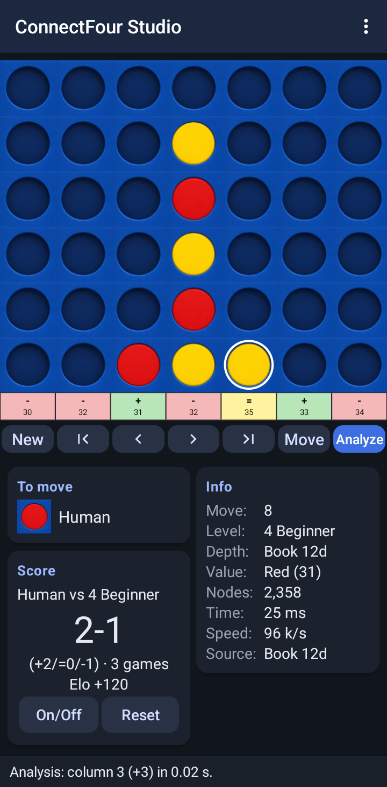
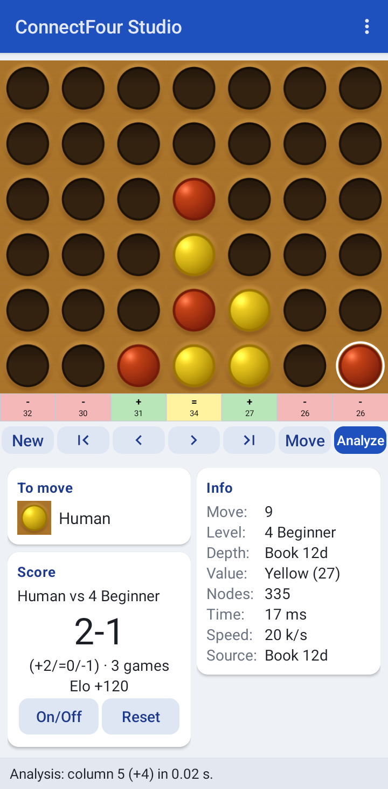
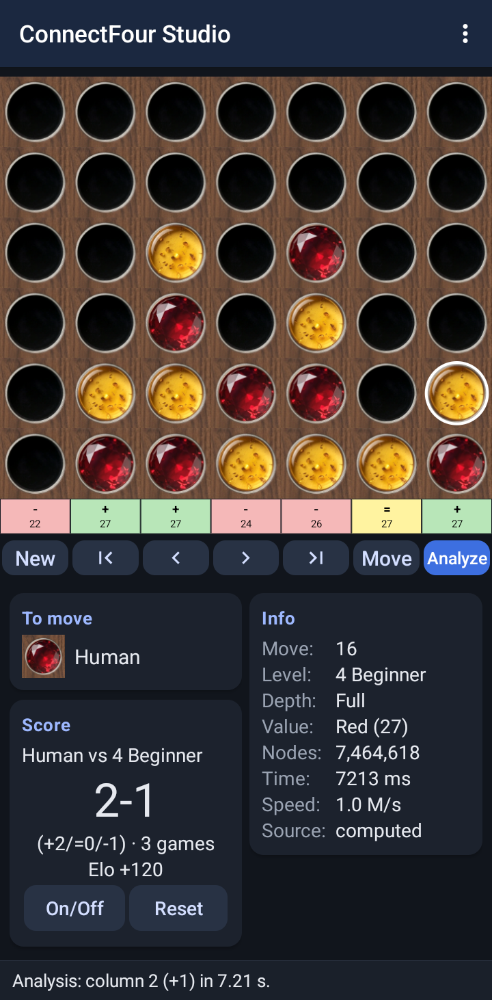

# ConnectFour Studio for Android

*Open-source Connect Four with 15 levels, 20 boards, match mode, session score
and perfect real-time analysis – the Android version of ConnectFour Studio.*

<p>
  
  
  
</p>

- **Engine:** Kotlin port of BitBully by Markus Thill (bitbully 0.0.79, C++
  core) with the 12-ply-dist opening book – same scores *and* node counts as
  the original engine (checked by the unit tests)
- **App:** Kotlin, Android framework only (no AndroidX, no Material library,
  no other runtime dependencies), minSdk 21 (Android 5.0), targetSdk 37
- **Languages:** English, German, French, Spanish, Dutch, Italian (in-app choice)
- **Permissions:** none – no internet, no tracking, no ads
- **License:** GNU AGPL v3 (`LICENSE`); assets see `ASSETS.md`

Feature comparison with the desktop (Qt) version: `FEATURES.md`.
Design decisions and placeholders to adjust: `DECISIONS.md`.

## Project layout

- `core/` – pure Kotlin/JVM module (no Android): game and `.4gp` format,
  BitBully engine port (`engine/`), levels (p, s, w), engine move choice,
  match and session score; JUnit tests incl. comparison with the Python engine
- `app/` – Android app: `Controller` (game flow, port of the Qt `MainWindow`),
  `BoardView` (Canvas), `MainActivity`, `MatchActivity`, `HelpActivity`
- `app/src/main/res/values*/strings.xml`, `res/raw*/help.json`,
  `assets/sets/`, `assets/book/` – generated from the desktop sources (see
  `scripts/`), committed so that the build needs no Python
- `scripts/` – generators: `gen_resources.py` (texts, help, stone sets),
  `encode_book.py` (opening book), `gen_engine_reference.py` (test reference
  data from the Python engine), `gen_icons.py` (PNG icons)
- `fastlane/` – F-Droid metadata (en-US, de-DE), `docs/fdroid-metadata.yml` –
  template for the fdroiddata recipe

## Build

Requirements: Android SDK with platform `android-37` and build-tools
`36.0.0`, a JDK 21 (Gradle selects it via `gradle/gradle-daemon-jvm.properties`;
the wrapper itself may start on any JDK ≥ 17).

```bash
echo "sdk.dir=$HOME/Android/Sdk" > local.properties
```

```bash
export JAVA_HOME=/usr/lib/jvm/java-21-openjdk
```

```bash
./gradlew test lint assembleDebug assembleRelease
```

Results:

- `app/build/outputs/apk/debug/app-debug.apk` – debug build (debug-signed)
- `app/build/outputs/apk/release/app-release-unsigned.apk` – release build,
  unsigned, minified with R8 (F-Droid signs it or verifies a developer build)
- Test report: `core/build/reports/tests/test/index.html`
- Lint report: `app/build/reports/lint-results-debug.html`

To sign a release yourself (e.g. for GitHub releases / reproducible builds):

```bash
~/Android/Sdk/build-tools/36.0.0/zipalign -p -f 4 app/build/outputs/apk/release/app-release-unsigned.apk ConnectFourStudio-aligned.apk
```

```bash
~/Android/Sdk/build-tools/36.0.0/apksigner sign --ks my-release.jks --out ConnectFourStudio-1.0.0.apk ConnectFourStudio-aligned.apk
```

## Install

On a device or emulator with USB/adb debugging enabled:

```bash
adb install -r app/build/outputs/apk/debug/app-debug.apk
```

```bash
adb shell am start -n io.github.patrickric.connectfourstudio/.MainActivity
```

The unsigned release APK cannot be installed directly; sign it first (see
above) or use the debug APK.

On the very first start the opening book (5.4 MB compressed) is unpacked once
into the app's private storage ("Preparing the opening book …"), which takes
about a second on a phone.

## Testing on a device / emulator

Unit tests (JVM, no device needed):

```bash
./gradlew test
```

They cover the game rules, `.4gp` compatibility (files from the desktop
tests), levels, guards, match/Elo/session score and compare the engine with
reference data from the Python engine
(`core/src/test/resources/engine_reference.json`).

Emulator with hardware acceleration (KVM), e.g. API 35:

```bash
~/Android/Sdk/cmdline-tools/latest/bin/sdkmanager "system-images;android-35;google_apis;x86_64" "emulator"
```

```bash
~/Android/Sdk/cmdline-tools/latest/bin/avdmanager create avd -n cfs35 -k "system-images;android-35;google_apis;x86_64" -d pixel
```

```bash
~/Android/Sdk/emulator/emulator -avd cfs35 -no-window -no-audio -no-snapshot &
```

```bash
adb wait-for-device shell 'while [ "$(getprop sys.boot_completed)" != 1 ]; do sleep 2; done'
```

Then install (see above) and drive the app, for example:

```bash
adb shell input tap 360 400
```

```bash
adb exec-out screencap -p > screen.png
```

```bash
adb logcat -d | grep -E "AndroidRuntime|FATAL"
```

Useful key events (hardware-keyboard shortcuts of the app): `adb shell input
keyevent 11` (key 4 = column 4), `131` F1 help, `133`/`134` F3/F4 quick
save/load, `135` F5 engine move, `136` F6 evaluate, `137` F7 permanent
analysis. Rotation: `adb shell settings put system accelerometer_rotation 0`
and `adb shell settings put system user_rotation 1` (landscape) / `0`.

Without KVM (no VT-x/AMD-V, as on the development machine of this port) x86
images do not run. ARM images (armeabi-v7a, API 21 and API 24 "default") still
work in pure software emulation with the older emulator 28.0.23
(`-engine classic` for API 21); they are very slow (engine moves take seconds
to minutes instead of milliseconds) but fine for functional tests. See
`DECISIONS.md` (Tests) for the test protocol.

## F-Droid

1. Publish the repository (e.g. `https://github.com/Patrick-Ric/connectfour-studio-android`)
   and adjust the application ID if needed (`DECISIONS.md`).
2. Tag the release: `git tag v1.0.0 && git push --tags`
   (`versionCode`/`versionName` in `app/build.gradle.kts`, changelog
   `fastlane/metadata/android/*/changelogs/<versionCode>.txt`).
3. Fork https://gitlab.com/fdroid/fdroiddata, copy `docs/fdroid-metadata.yml`
   to `metadata/<applicationId>.yml`, adjust URLs/commit, then check locally:
   `fdroid readmeta`, `fdroid lint <applicationId>`,
   `fdroid build -v -l <applicationId>` (with fdroidserver installed).
4. Open a merge request against fdroiddata ("New app: ConnectFour Studio").
5. Optional (reproducible builds): sign a release APK with your own key,
   attach it to the GitHub release and add `Binaries:` +
   `AllowedAPKSigningKeys:` to the recipe (see the comment in the template);
   F-Droid then ships your signed APK after verifying it bit for bit.

Store texts, icon and screenshots are read from `fastlane/metadata/android/`.

## Credits

- Engine: **BitBully by Markus Thill** – https://github.com/MarkusThill/BitBully (AGPL v3)
- Opening book: **bitbully-databases** (`12-ply-dist`) by Markus Thill – MIT
- Desktop program, stone sets, texts and help: ConnectFour Studio (Patrick Götz)
